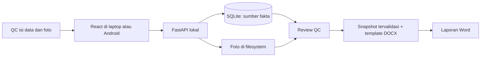

# Arsitektur Inspectra v0.1

STEP 1–10 sekarang terimplementasi. Stack berasal dari brief Bima; dokumen ini
mencatat batas yang sudah teruji dan pekerjaan Android/offline yang masih terbuka.

## Alur yang dituju



Frontend berkomunikasi dengan API lokal melalui same-origin `/api`. Vite proxy
dipakai saat pengembangan. Server laptop adalah pemilik SQLite dan foto. Tidak
ada cloud, login kompleks, ERP, OCR atau model AI dalam dependency core.

## Pilihan teknis

| Bagian | Pilihan | Tanggung jawab |
| --- | --- | --- |
| UI | React, TypeScript strict, Vite, Tailwind | Form, review, capture dan feedback simpan |
| HTTP | FastAPI + Uvicorn | Routes tipis dan validasi request |
| Persistence | SQLite + SQLModel | Domain tables, constraints, transaksi |
| Migration | Alembic | Revisi schema eksplisit, backup sebelum migrasi data nyata |
| Foto | Pillow + local filesystem | Validate, EXIF orientation, resize/compression, rotate |
| Word | python-docx + template config | Isi header, section/foto, measurement, issue, conclusion |
| AI | Interface opsional di fase berikutnya | Suggestion terpisah, hanya diterapkan setelah approval |

SQLModel merupakan salah satu opsi ORM yang diizinkan brief dan dipakai tutorial
FastAPI resmi; tidak diperlukan async database layer untuk scaffold satu server ini.
[FastAPI SQL databases](https://fastapi.tiangolo.com/tutorial/sql-databases/).
Versi package aktual dipin setelah resolver/registry diperiksa, bukan menebak
versi terbaru. `frontend/package-lock.json` dan `backend/requirements.lock` menjadi
input instalasi reproducible. [Vite requirements](https://vite.dev/guide/).

## Module boundaries

```text
frontend/src/
  pages/          dashboard dan workspace QC
  services/       typed fetch untuk API
  types/          contract frontend
backend/app/
  api/            health dan domain routes
  core/           konfigurasi path/origin
  database/       SQLite engine
  models/         SQLModel tables
  schemas/        create/patch/read payload
  services/       transaksi domain + foto
  report/         template loader + deterministic DOCX renderer
  ai/             protocol, tanpa provider wajib
backend/migrations/  Alembic domain revision
templates/      mapping dan template bersih; referensi privat di-ignore
data/           database, foto dan output privat
tests/          domain/API/report checks
tools/          utilitas inspeksi referensi spesifik project
```

Router tidak memilih template berdasarkan `if customer == ...`; service menyerahkan
snapshot ke report engine, lalu engine membaca konfigurasi customer/template.
Template loader menolak status selain READY dan file template yang tidak ada.
Hash referensi dicatat untuk audit; file asli tidak dibaca saat pembuatan laporan.

## Data model saat ini

| Entitas | Relationship dan aturan utama |
| --- | --- |
| Customer | UUID, kode unik, nama |
| Product | Customer FK, UUID, standar dimensi opsional, label axis fleksibel |
| Inspection | UUID, nomor unik `QC-YYYYMMDD-XXX`, product/customer FK, snapshot header, PO string, ISO date, location, QC, quantity, AQL value/label, status |
| Measurement | Inspection FK, kategori DIMENSION/MC/GLOSS/GAP/RADIUS/OTHER, label, actual/range/standar/toleransi terpisah, unit opsional, result INFO default |
| TestReading | Measurement FK, value, optional photo FK dari inspection sama, sortOrder |
| InspectionPhoto | Inspection FK, section, relative path, caption, sortOrder, optional issue FK dari inspection sama |
| Issue | Inspection FK, defectType, quantity nullable, cause/repair/CAP, status, provenance, sortOrder |
| DefectLibrary | Nama/aliases, opsi cause/repair/CAP, sumber preset; bukan fakta inspeksi baru |

Foreign keys aktif pada semua koneksi; update inspeksi dalam transaksi. Nomor
inspeksi memakai unique constraint dan retry konflik, bukan count tanpa lock.
Tanggal default memakai Asia/Jakarta. Snapshot menjaga laporan lama saat master
product/customer berubah. Standard, actual, sample quantity dan AQL tidak digabung.
Revisi Alembic `446c624e36d9` membuat domain schema; seed defect lokal berjalan
saat startup. Tidak ada `create_all` yang melewati migrasi.

## Storage dan backup

```text
data/qc.sqlite3
data/inspections/YYYY/MM/QC-YYYYMMDD-XXX/
  photos/<uuid>.jpg
  output/report-name.docx
```

Database menyimpan relative path + UUID, bukan input filename menjadi path.
Upload stage ke temporary file → validate decode/pixel/size limits → EXIF transpose
→ atomic rename → database transaction. Jika commit gagal, asset baru dibersihkan.
Upload dinormalisasi menjadi JPEG; original upload tidak disimpan. Rotasi menimpa
JPEG lokal setelah permintaan QC. Delete memastikan ownership, konfirmasi UI/API
dan path tidak keluar dari data root. Storage bukan folder arbitrary yang dibuka
lewat URL. Backup harus mencakup SQLite snapshot
melalui backup API serta foto; menyalin database WAL yang sedang aktif saja tidak cukup.

## Review dan report contract

- ERROR: metadata wajib kosong, referensi silang tidak valid, asset yang dipilih
  hilang/rusak, template tidak siap, suggestion AI belum confirmed.
- WARNING: box dimension kosong, section optional belum diperiksa, tolerance
  belum ada, issue belum lengkap. QC dapat mengatasi atau mengakui warning;
  template menentukan mandatory sections. Warning tidak otomatis menjadi ERROR.
- Report memakai data yang dibaca pada request generation; revisi inspeksi dicek
  saat patch metadata. Konflik edit foto/issue bersamaan belum mendapat lock end-to-end.
- MC/gloss range dihitung dari individual readings. Range-only import punya flag
  sumber. Missing tolerance menghasilkan INFO.
- Conclusion tidak menambahkan status PASS, telah repaired atau telah komunikasi.
- Output filename aman `{CUSTOMER}-{PRODUCT}-{YYMMDD}-{TYPE}.docx`; duplikasi
  diberi inspection number agar report berbeda tidak tertimpa.
- Report deterministik untuk input/config sama; ZIP timestamp dan core metadata
  distabilkan. Byte identity sudah diuji lewat API.

## API yang tersedia

`GET /api/health` memeriksa SQLite. Domain routes yang telah tersedia:

```text
GET/POST         /api/customers, /api/products, /api/inspections
GET/PATCH/DELETE /api/customers/{id}, /api/products/{id}, /api/inspections/{id}
POST             /api/inspections/{id}/photos|measurements|issues
PATCH/DELETE     /api/photos/{id}, /api/measurements/{id}, /api/issues/{id}
POST/PATCH/DELETE individual readings, nested pada measurement
GET/POST         /api/defects
POST             /api/inspections/{id}/validate
POST             /api/inspections/{id}/report/docx
```

Patch payload memisahkan omitted vs null. Autosave form memakai debounce dan
revisi inspeksi; status saved hanya muncul setelah API commit. Upload multi-file
masuk berurutan. Retry otomatis/idempotency key untuk gangguan jaringan belum ada.
AI endpoints ditambahkan saat fase AI saja; mock tidak ditampilkan sebagai hasil nyata.

## Local-first dan Android

Tanpa internet **dengan server laptop hidup**: SQLite, foto dan generator berjalan
lokal. HP tersambung LAN menggunakan server itu. **HP putus dari LAN/server**:
PWA saat ini mempunyai app shell service worker, tetapi edit saat putus membutuhkan
draft/Blob queue IndexedDB,
UUID client, replay idempotent dan conflict handling saat tersambung. IndexedDB
hanya antrean draft sementara; setelah sync, SQLite tetap authority. Generation
DOCX membutuhkan API lokal tersambung; jangan menjanjikan server Python berjalan
di service worker Android.

Manifest, ikon dan service worker sudah aktif di build produksi. Shell teruji
tetap tampil saat server berhenti, dengan status server terputus; data tidak
ditampilkan sebagai daftar kosong palsu. Offline write belum ada. PWA pernah
dibuka di emulator Android dan tombol kamera memanggil aplikasi kamera, tetapi
pengambilan foto tidak selesai; edit offline dan ketahanan setelah restart
perangkat belum dibuktikan.
HTTP `localhost` aman untuk dev laptop; alamat IP LAN HTTP dari HP tidak mendapat
pengecualian itu. Field deployment perlu HTTPS dengan certificate dipercaya perangkat.
[MDN secure contexts](https://developer.mozilla.org/en-US/docs/Web/Security/Defenses/Secure_Contexts),
[MDN service workers](https://developer.mozilla.org/en-US/docs/Web/API/Service_Worker_API/Using_Service_Workers).

Default bind loopback, CORS origins eksplisit. LAN exposure/TLS adalah deployment
milestone tersendiri. Jangan membuka origin wildcard atau menganggap Wi-Fi memberi
authorization. Core tidak memerlukan cloud walaupun instalasi dependency pertama perlu internet.

## DEV-INFRA yang diperiksa

Checkout lokal read-only `C:/Users/shint/OneDrive/Dokumen/ChatGPT/Bima-Dev_Infra`
pada SHA `4ebd5df21a9e71d4b19ecfd9e48cfaab79293b67`, bersih saat audit.
README, project contract, repository-audit contract dan daftar workflow diperiksa.
Tersedia repository hygiene, evidence/canonicalization dan artifact identity.
Tidak tersedia executable generic React/FastAPI build/test provider pada snapshot ini.

Project menyediakan `.bima/audit.json` sebagai input hygiene. Setelah commit
awal tersedia, auditor lokal DEV-INFRA dijalankan dari checkout shared dan
menghasilkan `pass`, 79 file, nol temuan, pada commit awal. Caller workflow
`.github/workflows/repository-hygiene.yml` memakai reusable workflow DEV-INFRA;
SHA workflow dan `infra-ref` sama-sama dipin ke commit yang telah diperiksa.
Hasil lokal bukan status GitHub. Run hosted pertama pada commit `e9e137b`
selesai sukses; artifact audit menyatakan 80 file dan nol temuan.

Build/test domain tetap command project dengan logs/JUnit. Hasil hygiene tidak
membuktikan DOCX/PWA/security acceptance. Error shared workflow/runner dilaporkan
ke DEV-INFRA; root cause yang sama pada dua project dipromosikan ke knowledge global.

## Status bukti

1. STEP 1–9: schema, migration, CRUD, foto, issue, persistence restart,
   validation dan rollback upload diuji di API serta sebagian alur UI.
2. STEP 10: template bersih dan generated DOCX diuji struktural serta dibuka
   Word. Tabel Gap dengan enam foto dan tiga caption berada dalam satu halaman
   bersama CAUSE/REPAIR/CAP; sampel uji lengkap 2 halaman.
3. PWA shell: manifest, service worker dan fallback saat server berhenti diuji
   di Chromium desktop. PWA pernah dipasang di emulator Android; capture selesai,
   offline edit/replay, restart perangkat, dan APK mandiri belum terbukti.
4. Defect presets: ada di UI dan perlu dipilih QC. AI tetap di luar v0.1.

## Preview laporan dan paket mandiri

Paket Windows `Inspectra.exe` memuat frontend, template Word bersih, migrasi,
FastAPI, SQLite dan generator DOCX. Data pengguna tetap di lokasi paket lama
`%LOCALAPPDATA%/QC Report Assistant/data` untuk menjaga kontinuitas.

Endpoint `POST /api/inspections/{id}/report/preview` menjalankan validasi yang
sama dengan unduhan DOCX, lalu merender DOCX itu melalui Microsoft Word read-only
dan PDFium. JPEG privat per halaman dicache berdasarkan hash DOCX; API hanya
melayani halaman milik revisi inspeksi saat ini. Preview persis ini membutuhkan
Word terpasang pada Windows. DOCX tetap dapat dibuat tanpa Word.

Android yang diminta harus menjalankan SQLite, foto, input, dan export sendiri
tanpa laptop. Paket APK, renderer preview tanpa Word, dan pengujian device masih
pekerjaan terbuka. PWA yang terpasang di emulator bukan APK.

